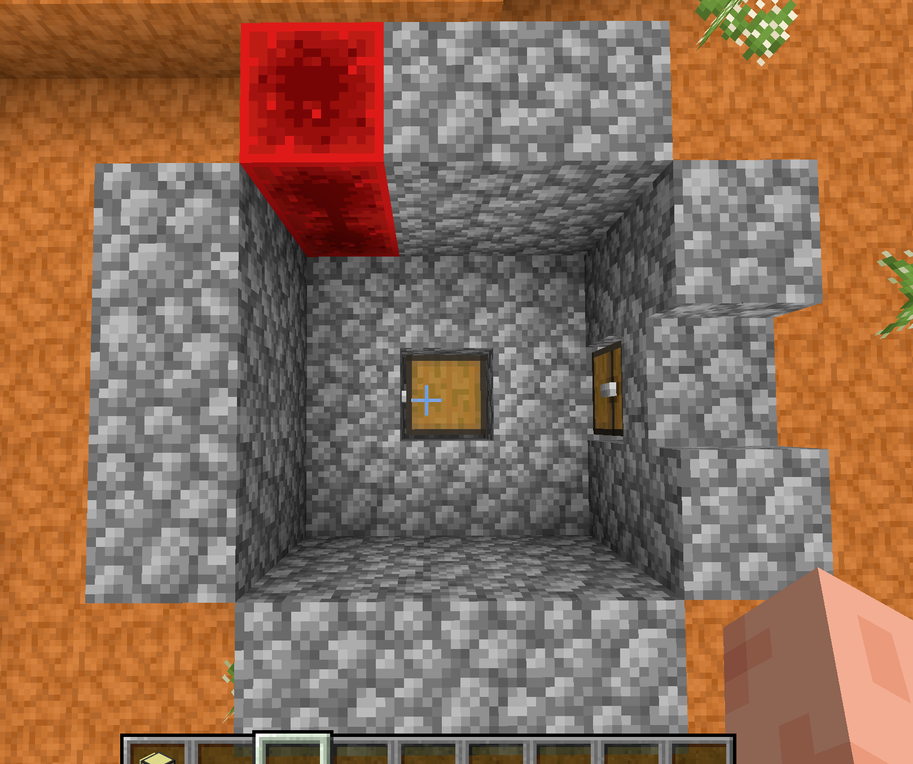
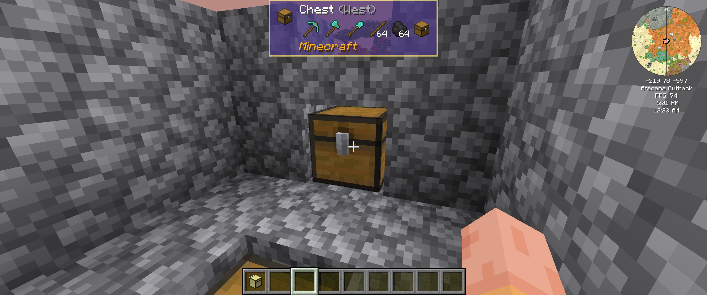
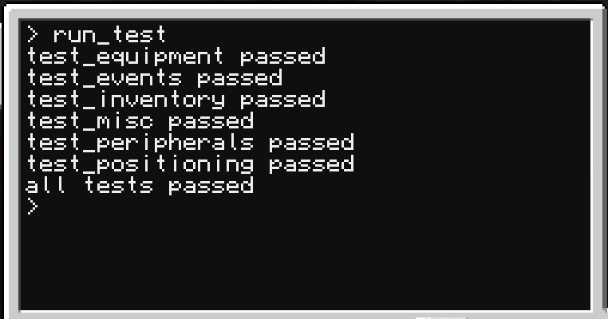

# cc-robot

## what is this?

`robot` enhances how `turtles` work.

main features:
- equip any number of tools at once (up to 18)
- auto-fuel your turtles, never need to track `turtle.getFuelLevel()`
- manage the inventory by item names, never need to interact with slots
- always know the (relative) position and facing of your turtle
- wrap your peripherals however you like
- pure lua, this is not a minecraft mod

see [DOCS.md](./DOCS.md) for documentation.

## usage

requires `CC:Tweaked 1.116.0` or higher.

run the installer `pastebin run mTMAhkam <install-dir>` ([pastebin link](https://pastebin.com/mTMAhkam)).

`<install-dir>` is optional.

get a `robot` instance using `require()`.
```lua
local robot = require("%INSTALL_DIR%/api/robot")

-- if no <install-dir> was passed, simply use:
local robot = require("/api/robot")
```

## multiple tools example
```lua
-- this snippet assumes you have a pickaxe, an axe, a shovel
-- and a sword somewhere in the turtle's inventory
local robot = require("%INSTALL_DIR%/api/robot")

local pickaxe = robot.equip("minecraft:diamond_pickaxe")
local axe = robot.equip("minecraft:diamond_axe")
local shovel = robot.equip("minecraft:diamond_shovel")
local sword = robot.equip("minecraft:diamond_sword")

-- print what we need to do in case some tool is missing
robot.onEquipmentWarning(function(_, name, waited)
    if not waited then
        print("waiting for " .. name)
        print("please put one into the inventory")
    end
end)

pickaxe.dig()
axe.digUp()
shovel.digDown()
sword.attack()

-- yes, we have four tools equipped at once. so what?
```
see [DOCS.md](./DOCS.md) for documentation.

## crafting example BROKEN, WORKING ON FIX
```lua
-- this snippet assumes the inventory only contains items required to craft pistons
local robot = require("%INSTALL_DIR%/api/robot")
local craftingTable = robot.equip("minecraft:crafting_table")

local pistonRecipe = {
    p = "minecraft:oak_planks",
    c = "minecraft:cobblestone",
    i = "minecraft:iron_ingot",
    r = "minecraft:redstone",
    pattern = [[
        p p p
        c i c
        c r c
    ]]
}

-- craft one piston
craftingTable.craft(pistonRecipe, 1)
```
see [DOCS.md](./DOCS.md) for documentation.

## auto-fuel example

auto-fuel is a feature that automatically consumes fuel when needed, i.E. when moving and low on fuel.

to auto-fuel, you simply need to specify which fuel(s) you want
and how much `robot` should stockpile of that fuel.

stockpiled / reserved items are never dropped or exported by `robot`.

```lua
-- snippet assumes turtle is not fully fueled
local robot = require("%INSTALL_DIR%/api/robot")

-- tell robot which fuel(s) to use and reserve space for
robot.setFuel("minecraft:coal_block")

-- print missing fuelLevel
robot.onFuelWarning(function(level, requiredLevel)
    print("has " .. level .. " requires " .. requiredLevel)
end)

-- try to move the maximum number of steps a turtle can move with max fuel
-- this triggers the fuel warning if the turtle is not fully fueled
-- put some coal_block into the inventory and see what happens
local steps = robot.getFuelLimit()
robot.forward(steps)
```
see [DOCS.md](./DOCS.md) for documentation.

## inventory example
```lua
-- this snippet assumes a chest (or items floating in the world) in front of the turtle
local robot = require("%INSTALL_DIR%/api/robot")

-- suck as much as we can from the chest into the turtle
robot.suck()

-- print the turtle inventory
for _, item in ipairs(robot.listItems()) do 
    print(item.name .. " = " .. tostring(item.count))
end

-- drop back all dirt (if any), we don't need it
robot.drop("minecraft:dirt")

-- select torches
robot.select("minecraft:torch")

-- keep at most one stack of torches, drop back the rest (if any)
local torchCount = robot.getItemCount()
robot.drop(torchCount - 64)
```
see [DOCS.md](./DOCS.md) for documentation.

## run_test example

to make sure `robot` works as intended, you can run `<install-dir>/examples/run_test`.

this requires a specific setup structure.

you need:
- 28x `cobblestone`
- 1x `cobblestone_slab`
- 2x `redstone_block`
- 3x `chest`
- 1x `pickaxe`
- 1x `axe`
- 1x `shovel`
- 64x `stick`
- 64x `coal`

### build the structure like this:
- it has a width of 3, a height of 2 and a length of 3.
- place the blocks as seen in the picture.



### the chest to the right must contain the items in order as seen here:


### the other chest must be empty

### how to run the test:
- place the turtle somewhere within the structure
- refuel the turtle, so it has more than `100` fuel, but significantly LESS than `turtle.getFuelLimit()`
- make sure there are no obstructions inside the structure (mobs, you, blocks)
- `pastebin run 2tfVSk7r` ([pastebin link](https://pastebin.com/2tfVSk7r)) if robot is not installed yet
- `run_test`
- this takes a while and the turtle does stuff.

### the output should look like this:


if any `error` or `assertion failure` occurs, check your setup.

if the error persists, this might mean that there is a bug in the current `robot` version.

please report it in this case, so I can fix it for us!

## Thank you and have fun!


